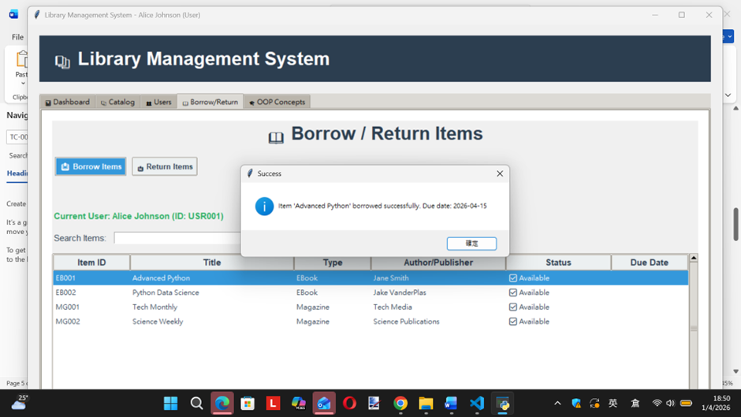
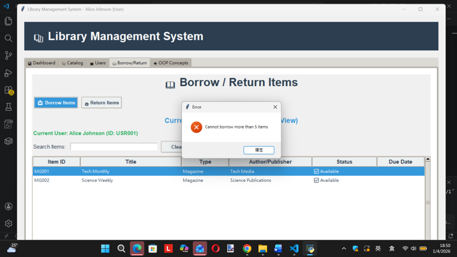
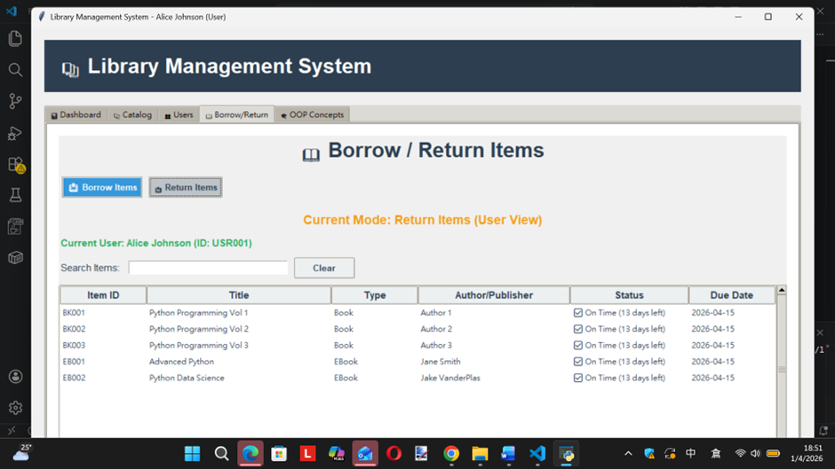
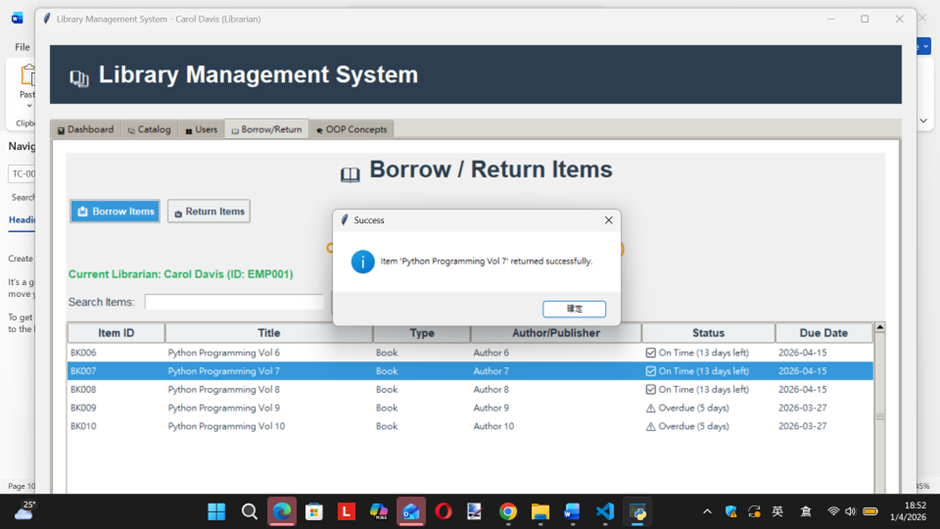
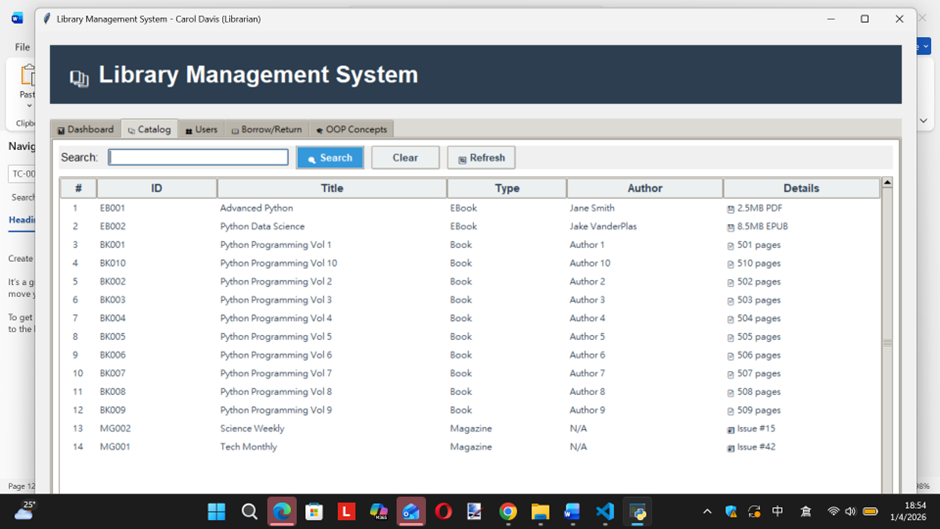
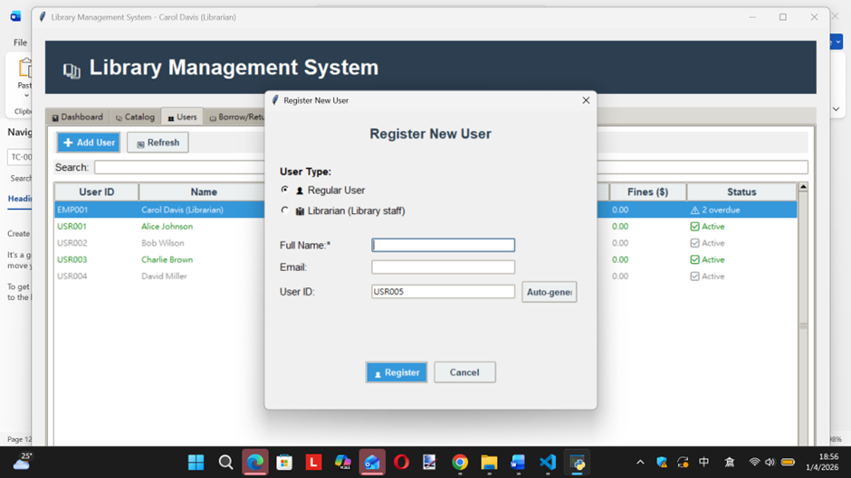
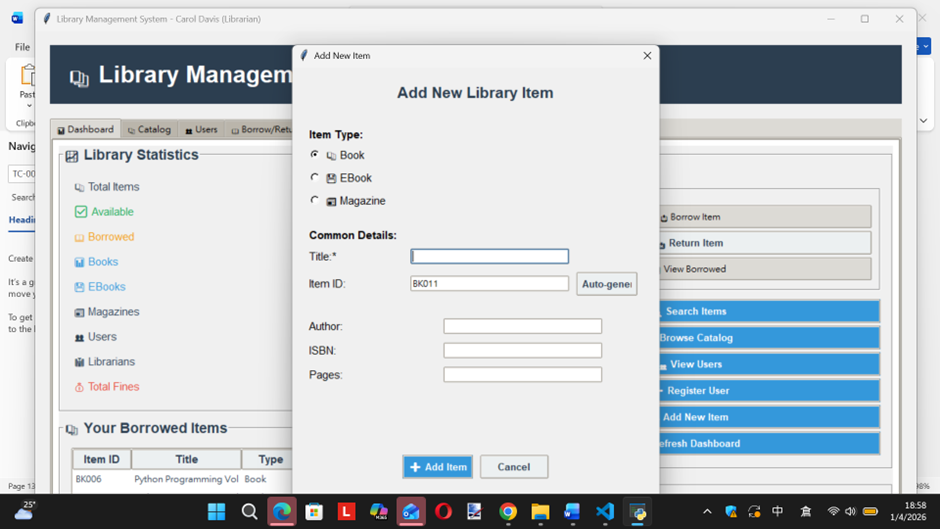
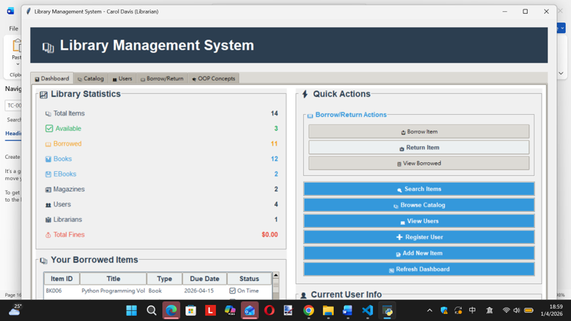
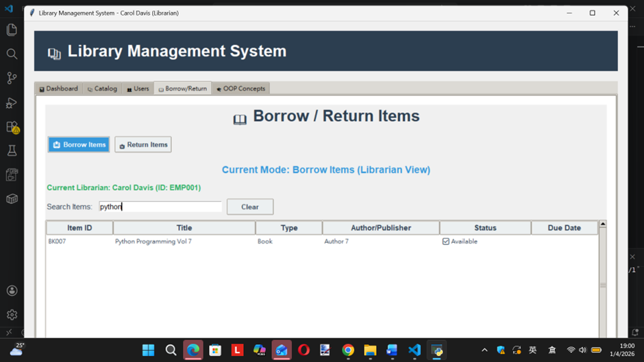

Library Management System

A comprehensive object-oriented library management system built with Python and Tkinter. This application demonstrates core OOP concepts while providing a functional GUI for managing library operations.

Prerequisites

Python 3.7 or higher

Tkinter (usually included with Python)

Installation

Clone the repository:

bash

click https://downgit.github.io/#/home?url=https://github.com/chongyukwai/OOPanddata/tree/main/library_system2.3

Run the application:

bash

python main.py

Test Cases for Library Management System
Test Case 1: Successful Borrowing (Happy Path) (Encapsulation)

Test Case ID	TC-001
Test Title	Successful borrowing of an available item
Objective	Verify that a user can successfully borrow an available library item. Ensure that data access is controlled via methods (encapsulation), preventing inappropriate direct attribute manipulation.
Preconditions	1. System is running
2. User "Alice Johnson" (ID: U001) exists and is active
3. Book "The Hobbit" (ID: I001) exists and is available
Test Steps	1. Premium user logs into the system
2. Navigate to the "Users" tab
3. Double click Select user "Alice Johnson" (U001) from user dropdown
4. Select item "The Hobbit" (I001) from item dropdown
5. Double Click the "Borrow" item
Expected Result	1.	System displays success message: "Item borrowed successfully"
2. Alice's borrowed items count increases by 1
3. "The Hobbit" appears in Alice's borrowed items list in Users tab

 
________________________________________
Test Case 2: Preventing Exceeding Borrowing Limit(Encapsulation/Business Logic)

Test Case ID	TC-002
Test Title	System prevents user from exceeding borrowing limit
Objective	Verify that the business rule enforcing maximum borrowing limit (5 items) works correctly
Preconditions	1. System is running
2. User "Alice Johnson" (ID: U001) exists and is active
3. User currently has 5 borrowed items (at borrowing limit)
4. At least one additional available item exists (e.g., "1984", ID: I006)
Test Steps	1. Librarian navigates to "Borrow" tab
2. Select user "Alice Johnson" (U001)
3. Select available item "1984" (I006)
4. Click the "Borrow" button
Expected Result	1. System rejects the borrow operation
2. Error message displayed: "Borrowing limit reached for this user (max 5 items)"

1. User's borrowed items count remains at 5
 
________________________________________
Test Case 3: Preventing Borrowing Already Borrowed Item (Encapsulation - Item Availability
)Test Case ID	TC-003
Test Title	System prevents multiple users from borrowing the same item
Objective	Verify that item availability is protected through encapsulation
Preconditions	1. System is running
2. User "Alice Johnson" (U001) exists and is active
3. User "Carol Davis" (EMP001) exists and is active
4. Book "The Hobbit" (I001) is currently borrowed by Carol 
Test Steps	1. Librarian navigates to "users" tab
2. Switch and double click to Carol Davis from user dropdown
3. Select item "The Hobbit" (I001) from item dropdown
4. Double-Click the "Borrow" button
Expected Result	
1. Carol Davis's borrowed items list contain "The Hobbit"
2. Other users cannot borrowed the item called "The Hobbit" since after switch,
That we will not see in the borrow list.
 
 
Test Case 4: Successful Return of Item(Encapsulation/State Change)

Test Case ID	TC-004
Test Title	Successful return of a borrowed item
Objective	Verify that a user can successfully return a borrowed item, updating the states of both User and LibraryItem objects.
Preconditions	1. System is running
2. User "Carol " (U001) has borrowed "The Hobbit" (I001)

Test Steps	1. Search the user and type Carol at the search column
2.Double click and Select user "Carol " (U001)
3. Librarian navigates to "Return" tab
4. Select borrowed item "The Hobbit" from user's borrowed items list
5. Double Click the "Return" item
Expected Result	1.	System displays success message: "Item returned successfully"
2. Item is removed from Alice's borrowed items list
3. Alice's borrowed items count decreases by 1
 
________________________________________
Test Case 5: Polymorphic Catalog Display
Test Case ID	TC-005
Test Title	Catalog displays different item types with their specific details
Objective	Verify that polymorphism correctly displays type-specific information for different library items
Preconditions	1. System is running
2. A Book exists: "The Hobbit" by J.R.R. Tolkien, 310 pages
3. An eBook exists: "Digital Fortress" by Dan Brown, 384 pages, 2.5 MB
4. A Magazine exists: "National Geographic", Issue 3, National Geographic Society
Test Steps	1. Librarian navigates to "Catalog" tab
2. Observe the list of all items displayed
Search for library item for example type “Hobbit:3.
Expected Result	1.	All three items appear in the same list
2. Book row shows details: "J.R.R. Tolkien, 310 pages"
3. eBook row shows details: "Dan Brown, 384 pages, 2.5 MB"
4. Magazine row shows details: "Issue 3, Publisher: National Geographic Society"
5. Each item's get_details() method produces type-appropriate output
Here is just an example.

 
________________________________________
Test Case 6: User Registration and Activation(Object Instantiation)

Test Case ID	TC-006
Test Title	Successful registration of a new library user
Objective	Verify that a new User object can be properly instantiated and activated in the system.
Preconditions	1. System is running
2. No existing user with email "newuser@example.com"
Test Steps	1. Librarian navigates to "Users" tab
2. Click "Add New User" button
3. Enter name: "Charlie Brown"
4. Enter email: "charlie@example.com"
6. Click "Register"
Expected Result	1. System displays success message: "User registered successfully"
2. New user appears in users list with ID (auto-generated)
3. User status shows as "Active"
4. User has 0 borrowed items initially

 
Test Case 7: Adding Different Item Types to Catalog(Inheritance)

Test Case ID	TC-007
Test Title	Adding various library item types to the catalog
Objective	Verify that different item types (Book, eBook, Magazine) can be added with their specific attributes
Preconditions	1. System is running
Test Steps	1. Librarian navigates to "Add Item" section
2. Select "Book" as item type
3. Enter title: "Clean Code", author: "Robert Martin", ISBN: "9780132350884", pages: 464
4. Click "Add"
5. Repeat steps 2-4 for an eBook and a Magazine with appropriate attributes
Expected Result	1. All three items are successfully added to the catalog
2. Each item has a unique ID (auto-generated)
3. Book shows author and page count in details
4. eBook shows author, page count, and file size in details
5. Magazine shows issue number and publisher in details
6. All items initially show status "Available"

Test Case 8:  Inheritance - Multi-level Hierarchy Validation
Test Case ID	TC-08
Test Title	Validate multi-level inheritance in eBook class
Objective	Verify that eBook class inherits correctly from Book class, which inherits from LibraryItem
Preconditions	1. System is running
Test Steps	1. Create an eBook instance with title "Digital Fortress", author "Dan Brown", ISBN "9780552161275", pages 384, file size 2.5 MB, format "EPUB"
2. Call methods from all levels of the inheritance hierarchy
Expected Result	1.	eBook has access to LibraryItem attributes (title, item_id, is_available)
2. eBook has access to Book attributes (author, isbn, page_count)
3. eBook has its own attributes (file_size, format)
4. get_details() method displays combined information from Book and eBook levels
5. check_out() method from LibraryItem works correctly for eBook
 
Test Case 9: Polymorphism - Uniform Processing of Mixed Collections
Test Case ID	TC-09
Test Title	System processes mixed collections of items polymorphically
Objective	Verify that methods can operate uniformly on collections containing different item types
Preconditions	1. System has multiple Books, eBooks, and Magazines in catalog
2. Some items are return, some are available
Test Steps	1.	Retrieve all items from catalog into a single list
2. Iterate through list and call get_item_type() on each by double clicking it
3. Iterate through list and call get_details() on each by double clicking it
 
Test Case 10: Class Variable - Total Items Tracking
Test Case ID	TC-010
Test Title	Validate class variable tracks total items across all subclasses
Objective	Verify that the class variable in LibraryItem correctly counts all created objects, regardless of their subclass.
Preconditions	1. System starts with no items
Test Steps	1. Create 3 Book objects
2. Create 2 eBook objects
3. Create 1 Magazine object
4. Access the class variable total_items_created from LibraryItem
Expected Result	1.	After each creation, the count increments appropriately
2. Final count is 6
3. Each subclass constructor correctly increments the parent class variable
4. The count represents total items regardless of type
 
Test Case 11: Search item function(Object Collection Filtering)

Test Case ID	TC-11
Test Title	Search for the name of the item, object collections
Objective	Search for the name of the item within the catalog, borrow list, or return list by filtering collections of objects.
Preconditions	1. System is running
Test Steps	1.	Create an eBook instance with title "Digital Fortress", author "Dan Brown", ISBN "9780552161275", pages 384, file size 2.5 MB, format "EPUB"
2.	 Search the eBook and type in Digital in the search column in Borrow item
Expected Result	1. Only one eBook has been displayed in the borrow 

